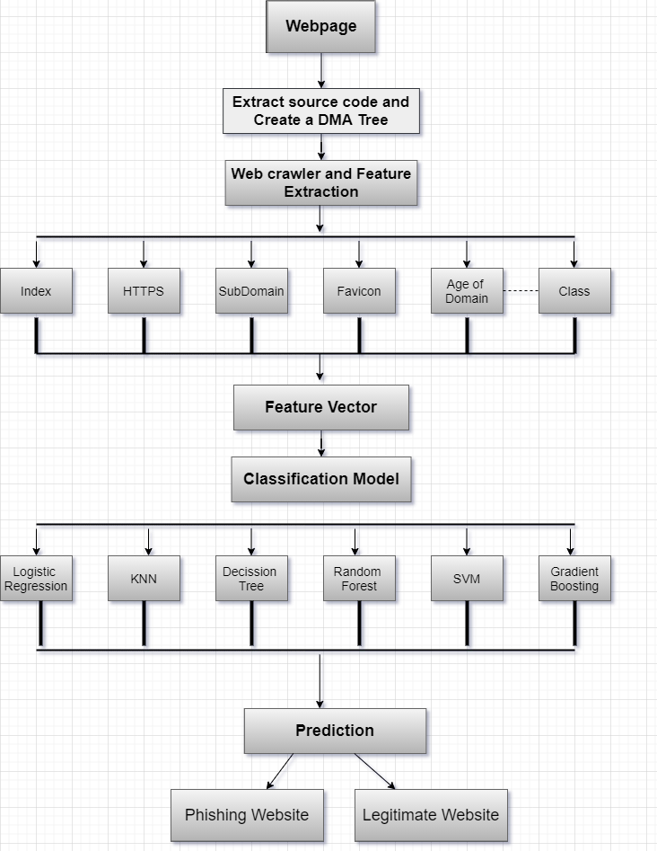

# Phishing Detection Using Machine Learning

This repository contains a project on **Phishing Detection Using Machine Learning**, implemented in Python with the help of Jupyter Notebook. The goal is to build a machine learning model that accurately identifies phishing websites based on specific features and patterns.

## About the Project

Phishing is a malicious attempt to steal sensitive information like usernames, passwords, or credit card details by impersonating trustworthy entities. This project leverages machine learning algorithms to detect phishing websites and protect users from potential scams.

### Key Features:
- **Feature Extraction**: Extracts relevant features from website URLs and metadata.
- **Machine Learning Models**: Implements various machine learning algorithms to classify websites as phishing or legitimate.
- **Evaluation Metrics**: Includes precision, recall, F1-score, and accuracy to assess model performance.

---

## File Structure
- **`Phishing_Detection_Using_Machine_Learning.ipynb`**: Jupyter Notebook containing the code, data preprocessing, model training, evaluation, and results.
- **README.md**: Documentation for the repository (you are reading this file).

---

## Prerequisites and Installation

### Prerequisites:
1. Install Python (>=3.7).
2. Install Jupyter Notebook.
3. Ensure the following libraries are installed:
   - `pandas`
   - `numpy`
   - `scikit-learn`
   - `matplotlib`
   - `seaborn`

### Installation:
1. Clone this repository:
   ```bash
   git clone https://github.com/smhasan24/Phishing_Detection_Using_Machine_Learning.git
   ```
2. Navigate to the project directory:
   ```bash
   cd Phishing_Detection_Using_Machine_Learning
   ```
3. Open the notebook:
   ```bash
   jupyter notebook Phishing_Detection_Using_Machine_Learning.ipynb
   ```

---

## Usage
1. Load the notebook and run the cells sequentially.
2. Follow the steps for data preprocessing, feature engineering, and model training.
3. Use the trained model to predict whether a given website is legitimate or phishing.

## Research Approach for this Research: 


---

## Results
This project demonstrates the effectiveness of machine learning algorithms in detecting phishing websites. The final model achieved:


*Replace these placeholders with your results.*

---

## Future Enhancements
- Add more features for better detection accuracy.
- Explore deep learning methods for advanced classification.
- Integrate the model into a real-time application.

---

## License
This project is licensed under the [MIT License](LICENSE) - you are free to use, modify, and distribute this project with attribution.

---

## Author
**SM Hasan**  
- MSc in Artificial Intelligence and Robotics, University of Hertfordshire  
- [LinkedIn](https://www.linkedin.com/in/hasanmahmud032) | [GitHub](https://github.com/smhasan24)

